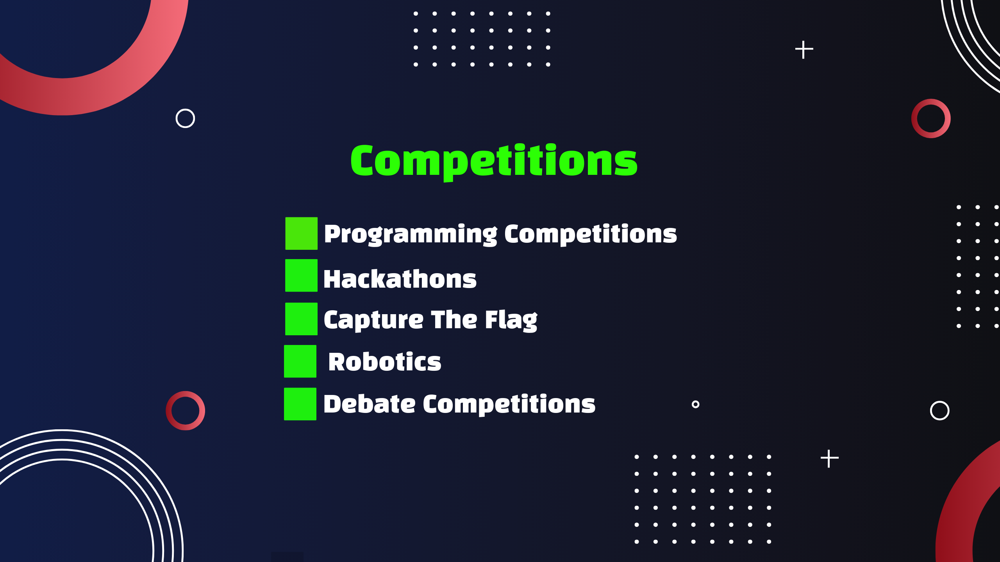

## Khalid Abdullah
- Final Year Undergrad student
- **ICPC Asia Dhaka Regionalist**
- **Problemsetter**
  - [**IUPC Ep1**](https://toph.co/arena?practice=64765afcd47a320767c000cf#!/p/6473fe50d47a320767bfcdb8)
    - Save money
    - Evenly Divisible

 **You will find the video** [**here**](https://youtu.be/I_G102qz_pk)

## Highlights

- **Competitions**
  - **Problem solving**
    - Onsite/Offline Contest(ICPC,IUPC) - Team Contests
    - Online Contest - Individual Contest
      - [Codeforces](https://codeforces.com)
      - [Codechef](https://codechef.com)
      - [Atcoder](https://atcoder.jp)

  - **Hackathon**
    - Online Hackathon
      - [Major League Hacking](https://mlh.io/)
      - [Devpost](https://devpost.com/)
    - Onsite Hackathon(Inter University Hackathons)

   - **Capture The Flag**
     - Online
     - Offline/Onsite
   - **Robotics**
     - LFR (Line Follower Robot)
     - Robo Soccer
     - Rover Challenge
   - **Others**
     - **Debate***
       - Intra
       - Inter
     - Idea & Poster presentation
       - Intra
       - Inter
     - Business Competition
       - Intra
       - Inter  
      

Intra Vs Inter

     Intra : Internal  
     Inter : External
     

- WHY Debate?
       
- Open Source Contribution
  - [Youtube: Kunal Kushwaha](https://youtube.com/@KunalKushwaha?si=O2JbR6DLmXpGFWYp)
  
- Projects
  - JS / Python
  - OOP
  - SQL
- Opportunities
  - Permanent Campus

- Higher Study
- CGPA
 
 
  

    
Already Late?

    6 months bootcamp
    
- Ready Enough?
  - Attention Span
  - Time Management 
  

Some Faults in us
